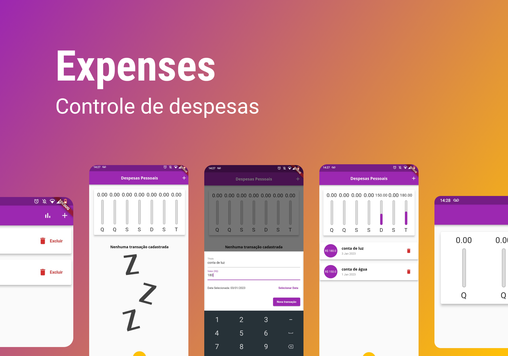

<h1 align="center"> Expenses </h1>

Projeto Expenses do curso Aprenda Flutter & Dart e Construa APPs iOS e Android da Cod3r atualizado para o Flutter 3.  

  <a href="#-tecnologias">Tecnologias</a>&nbsp;&nbsp;&nbsp;|&nbsp;&nbsp;&nbsp;
  <a href="#-projeto">Projeto</a>&nbsp;&nbsp;&nbsp;|&nbsp;&nbsp;&nbsp;
  <a href="#-executando-o-projeto">Executando o projeto</a>&nbsp;&nbsp;&nbsp;|&nbsp;&nbsp;&nbsp;<a href="#-licença">Licença</a>

  

 

  

---

## 🚀 Tecnologias

Esse projeto foi desenvolvido com as seguintes tecnologias:

- Dart 
- Flutter
- Interfaces responsivas
- Interfaces adapatativas entre IOS e Android

---

## 💻 Projeto

O app Expenses é um aplicativo projetado para controlar suas despesas, mostrando um gráfico com informações dos últimos sete dias. A interface se adapta a diversos tamanhos de tela e com interfaces diferentes seguindo o padrão IOS ou Andorid.

---

## 🔖 Executando o projeto

Trata-se de um projeto em Flutter, para executar é necessário:

- Ter a linguagem Dart e o Flutter instalados na sua máquina e presentes no path do sistema.
- Ter um emulador instalado ou um dispositivo físico disponível para testes do projeto.
- Baixar o conteúdo do repositório, seja clonando ou via download de arquivo zip.
- Em um terminal apontando para a pasta do projeto utilizar o comando `flutter pub get`.
- Executar seu dispositivo para testes e usar o comando `flutter run` no terminal.
- Também é possível executar diretamente pelo Visual Studio Code através do comando "CTRL + F5".

---

## 📝 Licença

Esse projeto está sob a licença MIT.

---

Feito com 💜 by Thiago Pereira 👋
